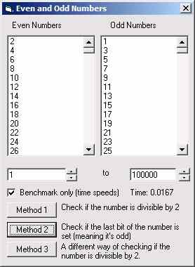



## Even or Odd?

### Description

Nothing spectacular or ground breaking, but just a little piece of code I thought I would do in 20 minutes. After 'Fateha Rahman's attempts at writing this code, I felt my comments weren't really taking effect of improving their code much. So I decided to write this in 20 minutes of spare time to show how it should be done. This code shows 3 different methods of checking if a number is even or odd, and shows which is the fastest. It includes proper bench marking code with it.
 
### More Info
 

             |
---                |---
**Submitted On**   |2004-07-29 07:28:42
**By**             |[IRBMe](https://github.com/Planet-Source-Code/PSCIndex/blob/master/ByAuthor/irbme.md)
**Level**          |Beginner
**User Rating**    |3.4 (31 globes from 9 users)
**Compatibility**  |VB 5\.0, VB 6\.0
**Category**       |[Math/ Dates](https://github.com/Planet-Source-Code/PSCIndex/blob/master/ByCategory/math-dates__1-37.md)
**World**          |[Visual Basic](https://github.com/Planet-Source-Code/PSCIndex/blob/master/ByWorld/visual-basic.md)
**Archive File**   |[Even\_or\_Od1775367292004\.zip](https://github.com/Planet-Source-Code/irbme-even-or-odd__1-55228/archive/master.zip)

